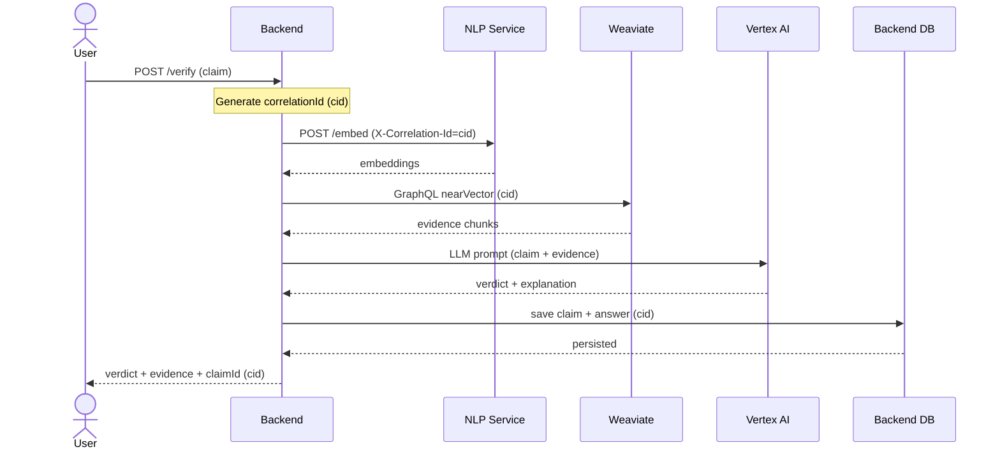
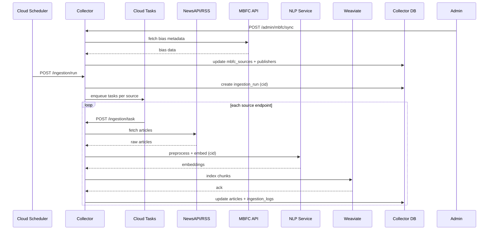

# Features & Requirements

## Epics Overview

| Epic | Description | Stories | Status |
|------|-------------|---------|--------|
| E1: Claim verification | Submit claims, view verdict, evidence, follow-ups, bias | 3 | Done |
| E2: Knowledge corpus | Continuously ingest, clean, chunk, embed, and index articles | 3 | Done |
| E3: Ops & quality | Admin controls, observability, tracing, and safety rails | 2 | Done |

## User Stories

### Epic 1: Claim verification

The user pastes a claim and receives an auditable answer enriched with evidence and conversation history.

| ID | User Story | Acceptance Criteria | Priority | Status |
|----|------------|---------------------|----------|--------|
| US-001 | As an analyst, I want to submit a claim and get a verdict | 200 OK; verdict + explanation + evidence list | Must | Done |
| US-002 | As an analyst, I want to ask follow-up questions | Follow-up stored with answer; correlation ID returned | Should | Done |
| US-003 | As an analyst, I want to see bias analysis of sources | Bias text returned and persisted | Could | Done |

#### Claim Verification Flow (Sequence)

### Epic 2: Knowledge corpus

Keep a fresh corpus of news articles suitable for RAG.

| ID | User Story | Acceptance Criteria | Priority | Status |
|----|------------|---------------------|----------|--------|
| US-004 | As an operator, I want to sync publishers and endpoints automatically | NewsAPI sync creates/updates endpoints | Must | Done |
| US-005 | As a pipeline, I want to ingest articles with robots compliance | Robots check, block handling, log status | Should | Done |
| US-006 | As a pipeline, I want to index semantic chunks with embeddings | Chunks created and indexed into Weaviate | Must | Done |

#### News Ingestion Flow (Sequence)

### Epic 3: Ops & quality

Make the system observable and auditable.

| ID | User Story | Acceptance Criteria | Priority | Status |
|----|------------|---------------------|----------|--------|
| US-007 | As an operator, I want to trace requests across services | Correlation ID propagated in logs and headers | Must | Done |
| US-008 | As an operator, I want to inspect ingestion runs and logs | Admin endpoints list runs/logs with status | Should | Done |

## Use Case Summary

- User submits a claim via web form or /api/claims/verify; backend runs retrieval + LLM and stores result.
- User opens claim history to review evidence, verdict, bias, and follow-ups.
- Cloud Scheduler triggers /ingestion/run to start a batch; tasks pull sources and index chunks into Weaviate.

## Non-Functional Requirements

### Performance

| Requirement | Target | Measurement Method |
|-------------|--------|-------------------|
| API response time | < 10s end-to-end with Vertex (no cache) | Manual test in prod/local |
| Ingestion throughput | 1k articles/day | Monitor ingestion logs and Weaviate counts |
| Concurrent users | 20 analysts on API/UI | Manual smoke test; horizontal scaling via containers |

### Security

- Internal-only deployment; secrets passed via env and never committed.
- Input validation on controllers and DTOs; Global exception handlers to avoid stack traces.
- HTTPS expected at ingress when deployed (Docker Compose uses HTTP locally).

### Accessibility

- Simple, readable HTML with server-side rendering; keyboard-only flow supported.
- No complex dynamic widgets; ensure form labels and error messages are visible.

### Reliability

| Metric | Target |
|--------|--------|
| Uptime | 99% for backend API in internal environment |
| Recovery time | Restart container < 1 minute | 
| Data backup | Cloud SQL backups if enabled; local volumes snapshot manually |

### Compatibility

| Platform/Browser | Minimum Version |
|------------------|-----------------|
| Chrome | 120 |
| Firefox | 120 |
| Safari | 16 |
| Mobile | Responsive but optimized for desktop |
