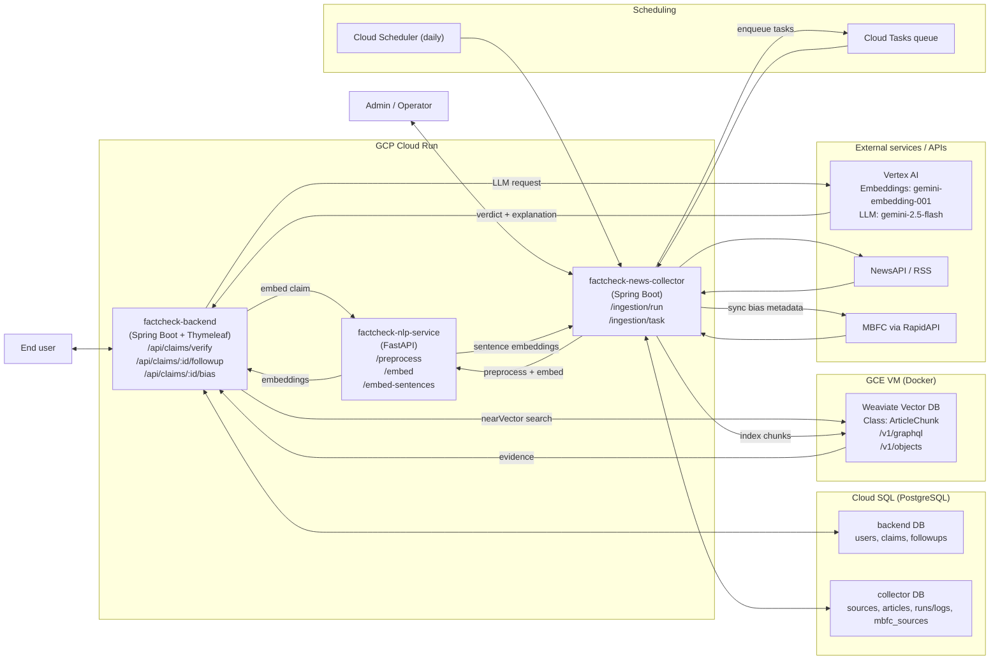
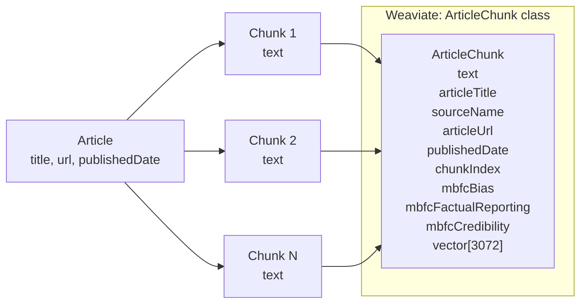

# 2. Technical Implementation

This section covers the technical architecture, design decisions, and implementation details.

## Contents

- [Tech Stack](tech-stack.md)
- [Criteria Documentation](criteria/) - ADR for each evaluation criterion
- [Deployment](deployment.md)

## Solution Architecture

### High-Level Architecture

### System Components

| Component | Description | Technology |
|-----------|-------------|------------|
| **Frontend** | Server-rendered UI for login and claims | Thymeleaf templates |
| **Backend** | Claim workflow, auth, persistence | Java 21, Spring Boot 3, JPA |
| **News Collector** | Ingestion, chunking, indexing | Java 21, Spring Boot 3 |
| **NLP Service** | Preprocess + embeddings | Python, FastAPI, Vertex AI |
| **Vector DB** | Evidence storage/search | Weaviate |
| **Databases** | Claims + catalog state | PostgreSQL (separate DBs) |

### Data Flow

`
Claim -> Backend /verify (JWT required)
      -> NLP embed -> Weaviate vector search
      -> Filter low-credibility sources (MBFC) -> Vertex Gemini prompt
      -> Stored with owner_username; correlation ID returned in responses/logs

Ingestion -> fetch sources -> preprocess/chunk
         -> embed -> index in Weaviate
Cloud Scheduler triggers /ingestion/run daily at 00:00; Cloud Tasks fan out /ingestion/task in production.
`

### Vector Store Schema (ArticleChunk)

## Security Overview

| Aspect | Implementation |
|--------|----------------|
| **Authentication** | JWT login/register (UI cookie + API Bearer) |
| **Authorization** | USER for UI + `/api/claims/**`; ADMIN for other API/admin routes |
| **Input Validation** | Claim length limits and DTO checks |
| **Secrets Management** | Env vars for JWT, DB, and external services |
| **Service-to-service auth** | Optional Cloud Run IAM: backend/collector send ID tokens to NLP when enabled |
